# Configuración de Proxy Inverso con Vagrant y Nginx

Este proyecto configura un entorno de desarrollo con Vagrant que incluye un servidor proxy inverso utilizando Nginx. El entorno consta de dos máquinas virtuales: `proxy` y `web`.

## Estructura del Proyecto

.vagrant/  
capturas/  
proxy/  
web/  
readme.md  
Vagrantfile

## Configuración del Vagrantfile

El archivo `Vagrantfile` define dos máquinas virtuales: `proxy` y `web`. Aquí está el contenido del archivo:

```ruby
Vagrant.configure("2") do |config|
  config.vm.box = "debian/bullseye64"

  config.vm.provider "virtualbox" do |vb|
    vb.memory = "256"
  end

  config.vm.provision "shell", inline: <<-SHELL
    apt-get update && apt-get install -y nginx
  SHELL

  config.vm.define "proxy" do |proxy|
    proxy.vm.hostname = "www.example.test"
    proxy.vm.network "private_network", ip: "192.168.57.10"
    proxy.vm.provision "shell", inline: <<-SHELL
      echo "192.168.57.11 w1" | sudo tee -a /etc/hosts
      sudo cp /vagrant/proxy/default /etc/nginx/sites-available/default
      sudo systemctl restart nginx
    SHELL
  end

  config.vm.define "web" do |web|
    web.vm.hostname = "w1.example.test"
    web.vm.network "private_network", ip: "192.168.57.11"
    web.vm.provision "shell", inline: <<-SHELL
      sudo cp /vagrant/web/default /etc/nginx/sites-available/default
      sudo cp /vagrant/web/index.html /var/www/html/index.html
      sudo apt install curl -y
      sudo systemctl restart nginx
    SHELL
  end
end
```

## Configuración del Servidor Proxy

El archivo de configuración del servidor proxy se encuentra en `proxy/default`:

```nginx
server {
    listen 80;
    listen [::]:80;

    server_name example.test www.example.test;

    location / {
        proxy_pass http://192.168.57.11:8080;
    }
}
```

## Configuración del Servidor Web

El archivo de configuración del servidor web se encuentra en `web/default`:

```nginx
server {
    listen 8080;
    listen [::]:8080;

    server_name w1;
    root /var/www/html;
    index index.html index.htm;

    location / {
        try_files $uri $uri/ =404;
    }
}
```

El contenido del archivo `index.html` es:

```html
<!DOCTYPE html>
<html lang="en">
  <head>
    <meta charset="UTF-8" />
    <meta name="viewport" content="width=device-width, initial-scale=1.0" />
    <title>example.test</title>
  </head>
  <body>
    <h1>example.test</h1>
    <h2>Bienvenido</h2>
    <p>Servidor w1</p>
  </body>
</html>
```

## Configuración del Archivo Hosts en la Máquina Anfitriona

Para que el servidor proxy reconozca el nombre `w1`, es necesario agregar la siguiente línea al archivo `/etc/hosts` de la máquina anfitriona:

```bash
192.168.57.11 w1
```

## Comprobación de Logs

### Logs del Servidor Proxy

Para verificar las solicitudes que pasan por el servidor proxy, accedemos a los logs en la máquina **proxy**:

```bash
sudo tail -f /var/log/nginx/access.log
```

### Logs del Servidor Web

En el servidor **w1**, podemos verificar las solicitudes que llegan a él:

```bash
sudo tail -f /var/log/nginx/access.log
```

### Comprobación de Cabeceras en Firefox

1. Abre Firefox y navega a `http://www.example.test`.
2. Presiona `Ctrl + Shift + I` o ve a **Herramientas** > **Desarrollador web** > **Herramientas de desarrollador**.
3. Ve a la pestaña **Red** (`Network`) y marca la opción **Deshabilitar caché**.
4. Recarga la página (`F5`) y examina la solicitud en la pestaña de red. Busca la cabecera `Host` en los **encabezados de solicitud** (Request Headers).

### Uso de DNS con nip.io

Accede a la URL `http://www.192.168.57.10.nip.io` y verifica que la cabecera `Host` cambia de `www.example.test` a `192.168.57.10.nip.io`.

### Añadir Cabeceras

#### En el Servidor Proxy

Agrega la cabecera `X-friend` en la configuración del servidor **proxy**:

```nginx
location / {
    proxy_pass http://192.168.57.11:8080;
    add_header X-friend your-name;  # Sustituye 'your-name' por tu nombre
}
```

Reinicia el servidor **proxy**:

```bash
sudo systemctl restart nginx
```

Verifica que la cabecera `X-friend` aparece en la respuesta.

#### En el Servidor Web

Añade la cabecera `Host` en la configuración del servidor **w1**:

```nginx
location / {
    add_header Host w1.example.test;
    try_files $uri $uri/ =404;
}
```

Reinicia el servidor **w1**:

```bash
sudo systemctl restart nginx
```

Verifica que la cabecera `Host` aparece en la respuesta.

## Capturas de Pantalla

### Configuración de Red en VirtualBox

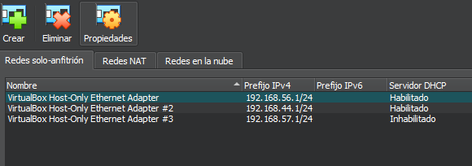

### Acceso a http://192.168.57.11:8080/

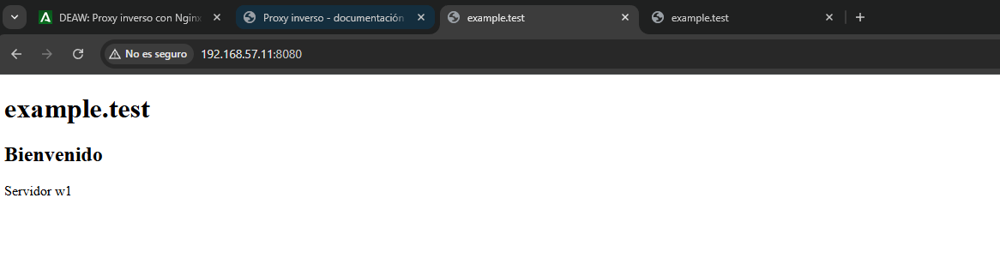

### Acceso a http://www.example.test/


### Archivo Hosts de la Máquina Anfitriona

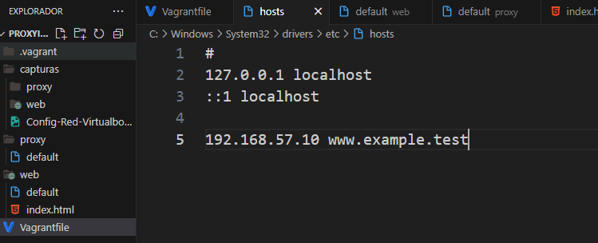

### Configuración del Proxy

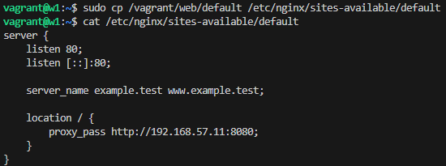
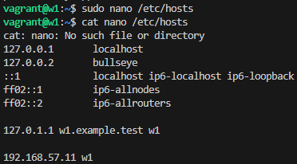
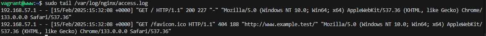

### Configuración del Servidor Web

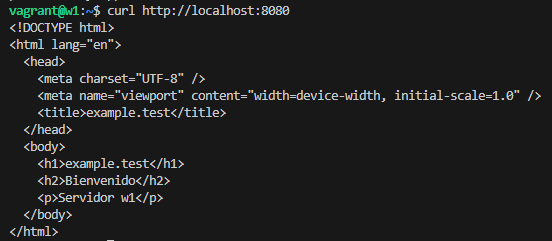
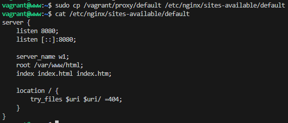
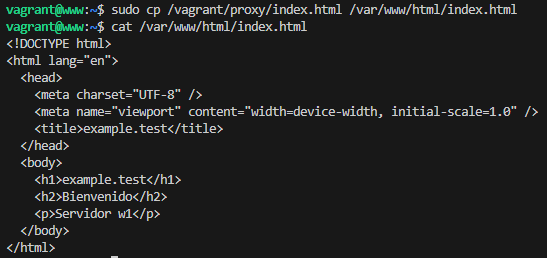
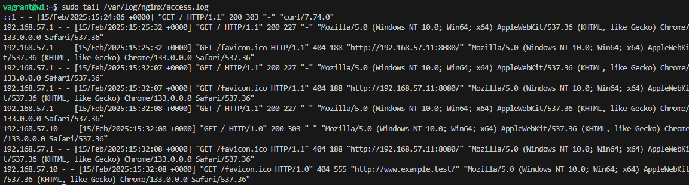

### Comprobacion


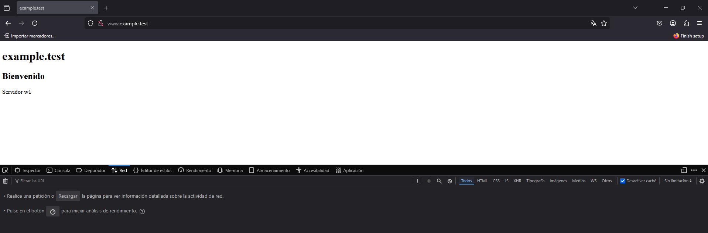
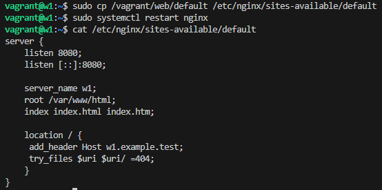
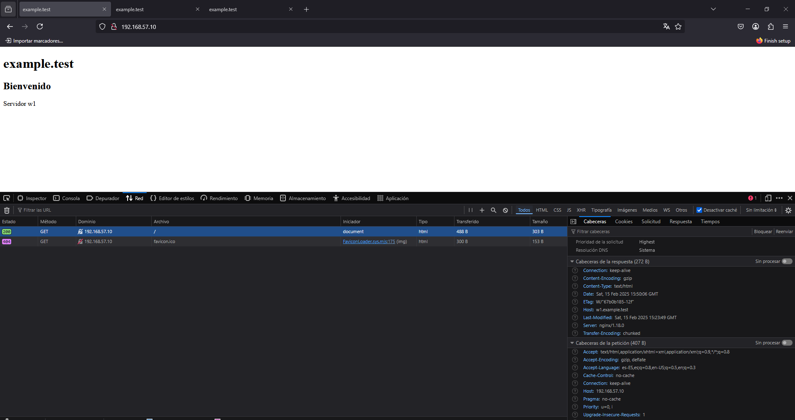
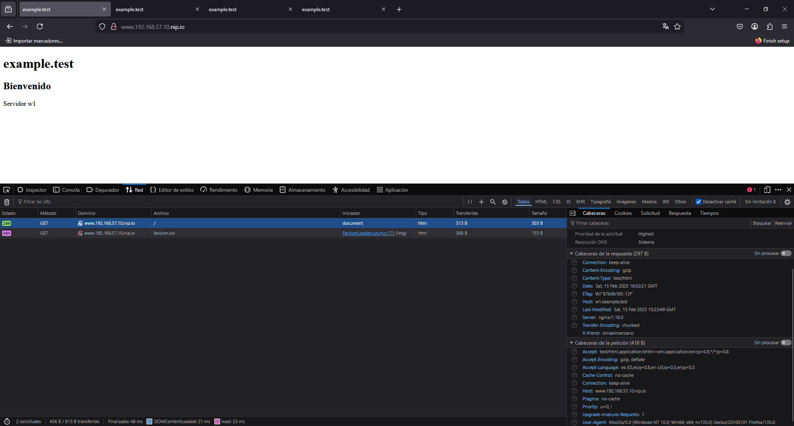
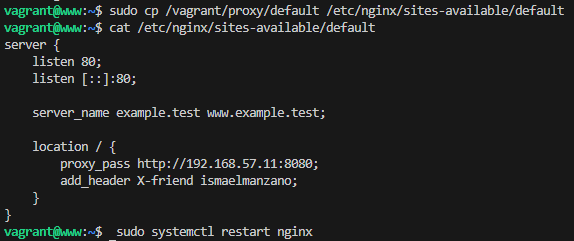
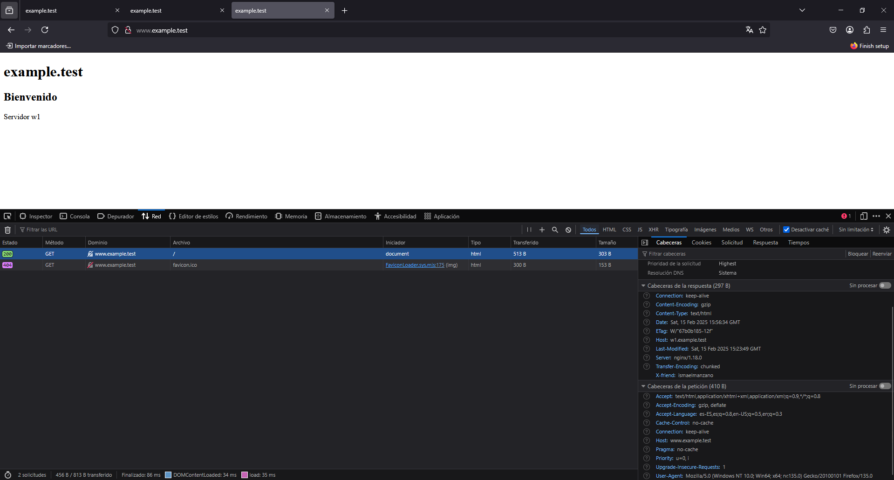

## Instrucciones para Levantar el Entorno

1. Clona este repositorio.
2. Navega al directorio del proyecto.
3. Ejecuta `vagrant up` para levantar las máquinas virtuales.
4. Accede a `http://192.168.57.11:8080/` y `http://www.example.test/` desde tu navegador.
5. ¡Y eso es todo! Ahora tienes un entorno de desarrollo con un servidor proxy inverso configurado con Vagrant y Nginx.
