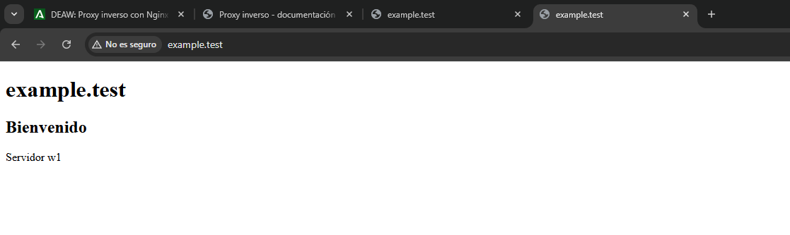
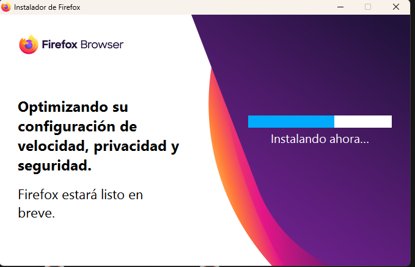
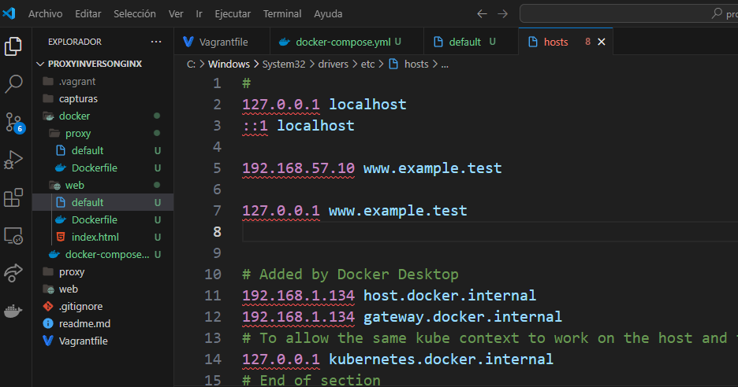
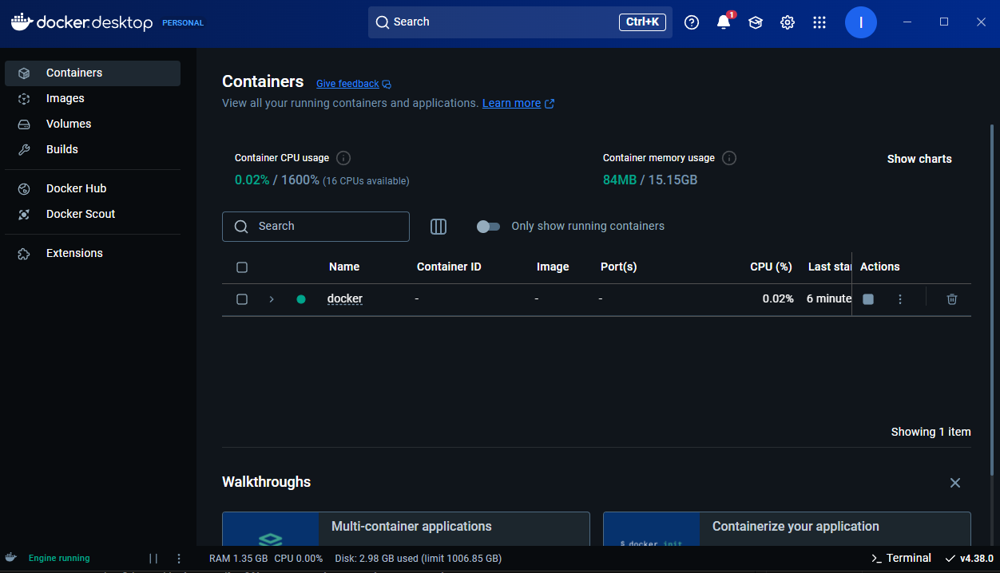
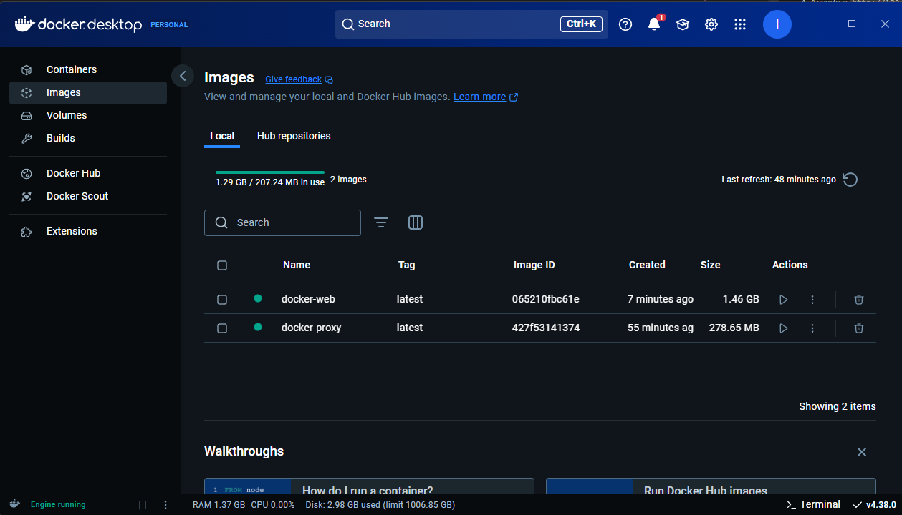
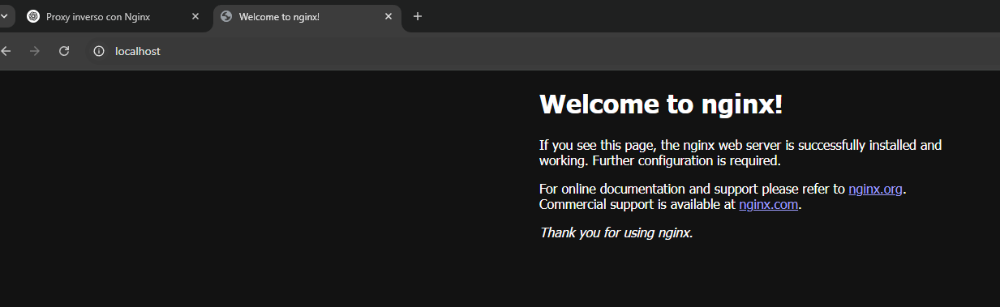

# Configuración de Proxy Inverso con Vagrant y Nginx

Este proyecto configura un entorno de desarrollo con Vagrant que incluye un servidor proxy inverso utilizando Nginx. El entorno consta de dos máquinas virtuales: `proxy` y `web`.

## Estructura del Proyecto

.vagrant/  
capturas/  
proxy/  
web/  
readme.md  
Vagrantfile

## Configuración del Vagrantfile

El archivo `Vagrantfile` define dos máquinas virtuales: `proxy` y `web`. Aquí está el contenido del archivo:

```ruby
Vagrant.configure("2") do |config|
  config.vm.box = "debian/bullseye64"

  config.vm.provider "virtualbox" do |vb|
    vb.memory = "256"
  end

  config.vm.provision "shell", inline: <<-SHELL
    apt-get update && apt-get install -y nginx
  SHELL

  config.vm.define "proxy" do |proxy|
    proxy.vm.hostname = "www.example.test"
    proxy.vm.network "private_network", ip: "192.168.57.10"
    proxy.vm.provision "shell", inline: <<-SHELL
      echo "192.168.57.11 w1" | sudo tee -a /etc/hosts
      sudo cp /vagrant/proxy/default /etc/nginx/sites-available/default
      sudo systemctl restart nginx
    SHELL
  end

  config.vm.define "web" do |web|
    web.vm.hostname = "w1.example.test"
    web.vm.network "private_network", ip: "192.168.57.11"
    web.vm.provision "shell", inline: <<-SHELL
      sudo cp /vagrant/web/default /etc/nginx/sites-available/default
      sudo cp /vagrant/web/index.html /var/www/html/index.html
      sudo apt install curl -y
      sudo systemctl restart nginx
    SHELL
  end
end
```

## Configuración del Servidor Proxy

El archivo de configuración del servidor proxy se encuentra en `proxy/default`:

```nginx
server {
    listen 80;
    listen [::]:80;

    server_name example.test www.example.test;

    location / {
        proxy_pass http://192.168.57.11:8080;
    }
}
```

## Configuración del Servidor Web

El archivo de configuración del servidor web se encuentra en `web/default`:

```nginx
server {
    listen 8080;
    listen [::]:8080;

    server_name w1;
    root /var/www/html;
    index index.html index.htm;

    location / {
        try_files $uri $uri/ =404;
    }
}
```

El contenido del archivo `index.html` es:

```html
<!DOCTYPE html>
<html lang="en">
  <head>
    <meta charset="UTF-8" />
    <meta name="viewport" content="width=device-width, initial-scale=1.0" />
    <title>example.test</title>
  </head>
  <body>
    <h1>example.test</h1>
    <h2>Bienvenido</h2>
    <p>Servidor w1</p>
  </body>
</html>
```

## Configuración del Archivo Hosts en la Máquina Anfitriona

Para que el servidor proxy reconozca el nombre `w1`, es necesario agregar la siguiente línea al archivo `/etc/hosts` de la máquina anfitriona:

```bash
192.168.57.11 w1
```

## Comprobación de Logs

### Logs del Servidor Proxy

Para verificar las solicitudes que pasan por el servidor proxy, accedemos a los logs en la máquina **proxy**:

```bash
sudo tail -f /var/log/nginx/access.log
```

### Logs del Servidor Web

En el servidor **w1**, podemos verificar las solicitudes que llegan a él:

```bash
sudo tail -f /var/log/nginx/access.log
```

### Comprobación de Cabeceras en Firefox

1. Abre Firefox y navega a `http://www.example.test`.
2. Presiona `Ctrl + Shift + I` o ve a **Herramientas** > **Desarrollador web** > **Herramientas de desarrollador**.
3. Ve a la pestaña **Red** (`Network`) y marca la opción **Deshabilitar caché**.
4. Recarga la página (`F5`) y examina la solicitud en la pestaña de red. Busca la cabecera `Host` en los **encabezados de solicitud** (Request Headers).

### Uso de DNS con nip.io

Accede a la URL `http://www.192.168.57.10.nip.io` y verifica que la cabecera `Host` cambia de `www.example.test` a `192.168.57.10.nip.io`.

### Añadir Cabeceras

#### En el Servidor Proxy

Agrega la cabecera `X-friend` en la configuración del servidor **proxy**:

```nginx
location / {
    proxy_pass http://192.168.57.11:8080;
    add_header X-friend your-name;  # Sustituye 'your-name' por tu nombre
}
```

Reinicia el servidor **proxy**:

```bash
sudo systemctl restart nginx
```

Verifica que la cabecera `X-friend` aparece en la respuesta.

#### En el Servidor Web

Añade la cabecera `Host` en la configuración del servidor **w1**:

```nginx
location / {
    add_header Host w1.example.test;
    try_files $uri $uri/ =404;
}
```

Reinicia el servidor **w1**:

```bash
sudo systemctl restart nginx
```

Verifica que la cabecera `Host` aparece en la respuesta.

## Capturas de Pantalla

### Configuración de Red en VirtualBox
  
*Descripción: Configuración de red en VirtualBox para las máquinas `proxy` y `web`.*

### Acceso a http://192.168.57.11:8080/
  
*Descripción: Acceso al servidor web en el puerto 8080.*

### Acceso a http://www.example.test/
  
*Descripción: Acceso al servidor proxy mediante el dominio `www.example.test`.*

### Archivo Hosts de la Máquina Anfitriona
  
*Descripción: Configuración del archivo `/etc/hosts` en la máquina anfitriona.*

### Configuración del Proxy
  
*Descripción: Configuración del servidor proxy en el archivo `default` del directorio `proxy`.*  
  
*Descripción: Archivo `/etc/hosts` en el servidor proxy para reconocer el nombre `w1`.*  
  
*Descripción: Logs de acceso en el servidor proxy.*

### Configuración del Servidor Web
  
*Descripción: Comprobación del acceso al servidor web localmente mediante `curl`.*  
  
*Descripción: Configuración del servidor web en el archivo `default` del directorio `web`.*  
  
*Descripción: Contenido del archivo `index.html` en el servidor web.*  
  
*Descripción: Logs de acceso en el servidor web.*

### Comprobación
  
*Descripción: Instalación de Firefox en la máquina anfitriona para comprobar las cabeceras.*  
  
*Descripción: Desactivación de la caché en las herramientas de desarrollador de Firefox.*  
  
*Descripción: Visualización de la petición hacia `w1.example.test` en Firefox.*  
  
*Descripción: Cabecera Host enviada desde el navegador con dirección `192.168.57.10`.*  
  
*Descripción: Visualización de la cabecera Host con el dominio `nip.io`.*  
  
*Descripción: Cabecera personalizada `X-friend` enviada desde el servidor proxy.*  
  
*Descripción: Cabecera `X-friend` mostrando el nombre `ismaelmanzano` en la respuesta del servidor web.*


## Instrucciones para Levantar el Entorno

1. Clona este repositorio.
2. Navega al directorio del proyecto.
3. Ejecuta `vagrant up` para levantar las máquinas virtuales.
4. Accede a `http://192.168.57.11:8080/` y `http://www.example.test/` desde tu navegador.
5. ¡Y eso es todo! Ahora tienes un entorno de desarrollo con un servidor proxy inverso configurado con Vagrant y Nginx.

## Configuración de Proxy Inverso con Docker y Nginx

Este proyecto también se puede configurar utilizando Docker, creando un entorno de desarrollo con un servidor proxy inverso utilizando Nginx. El entorno consta de dos contenedores: `proxy` y `web`.

### Estructura del Proyecto

```
docker/
proxy/
  Dockerfile
  default
web/
  Dockerfile
  app.py
  requirements.txt
  nginx.conf
  index.html
docker-compose.yml
```

### Configuración del `docker-compose.yml`

El archivo `docker-compose.yml` define dos servicios: `proxy` y `web`. Aquí está el contenido del archivo:

```yaml
version: "3.8"

services:
  web:
    build:
      context: ./web
    container_name: web
    ports:
      - "5000:5000"
    networks:
      - app-network

  proxy:
    build:
      context: ./proxy
    container_name: proxy
    ports:
      - "80:80"
    depends_on:
      - web
    networks:
      - app-network

networks:
  app-network:
    driver: bridge
```

### Configuración del Servidor Proxy

El archivo de configuración del servidor proxy se encuentra en `default`:

```nginx
server {
    listen 80;
    listen [::]:80;

    server_name example.test www.example.test;

    location / {
        proxy_pass http://web:8080;  # Redirige al contenedor 'web'
    }
}
```

El archivo `Dockerfile` para el servidor proxy se encuentra en `Dockerfile`:

```dockerfile
# Usar la imagen oficial de Nginx
FROM nginx:latest

# Copiar el archivo de configuración para el proxy
COPY ./default /etc/nginx/sites-available/default

# Exponer el puerto 80
EXPOSE 80
```

### Configuración del Servidor Web

El archivo de configuración del servidor web se encuentra en `default`:

```nginx
server {
    listen 8080;
    listen [::]:8080;

    server_name w1;
    root /var/www/html;
    index index.html index.htm;

    location / {
        try_files $uri $uri/ =404;
    }
}
```

El archivo `Dockerfile` para el servidor web se encuentra en `Dockerfile`:

```dockerfile
# Usar una imagen base de Python
FROM python:3.9

# Establecer el directorio de trabajo
WORKDIR /app

# Copiar los archivos de la aplicación al contenedor
COPY . /app

# Instalar las dependencias necesarias
RUN pip install --no-cache-dir -r requirements.txt

# Exponer el puerto 5000 para Gunicorn
EXPOSE 5000

# Comando para ejecutar Gunicorn (servidor de la app)
CMD ["gunicorn", "-w", "4", "-b", "0.0.0.0:5000", "app:app"]
```

El contenido del archivo `index.html` es:

```html
<!DOCTYPE html>
<html lang="en">
  <head>
    <meta charset="UTF-8" />
    <meta name="viewport" content="width=device-width, initial-scale=1.0" />
    <title>example.test</title>
  </head>
  <body>
    <h1>example.test</h1>
    <h2>Bienvenido</h2>
    <p>Servidor w1</p>
  </body>
</html>
```

El contenido del archivo `app.py` es:

```python
from flask import Flask
app = Flask(__name__)

@app.route('/')
def hello_world():
    return 'Hello, World!'

if __name__ == '__main__':
    app.run(debug=True)
```

El contenido del archivo `requirements.txt` es:

```
Flask
gunicorn
```

### Capturas de Pantalla

#### Archivo Hosts de la Máquina Anfitriona



#### Docker Desktop







### Instrucciones para Levantar el Entorno con Docker

1. Clona este repositorio.
2. Navega al directorio del proyecto.
3. Ejecuta `docker-compose up --build` para levantar los contenedores.
4. Accede a `http://localhost:5000/` y `http://www.example.test/` desde tu navegador.
5. ¡Y eso es todo! Ahora tienes un entorno de desarrollo con un servidor proxy inverso configurado con Docker y Nginx.
